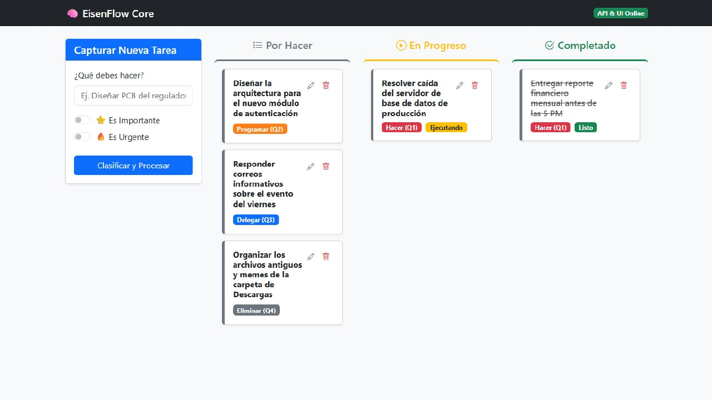
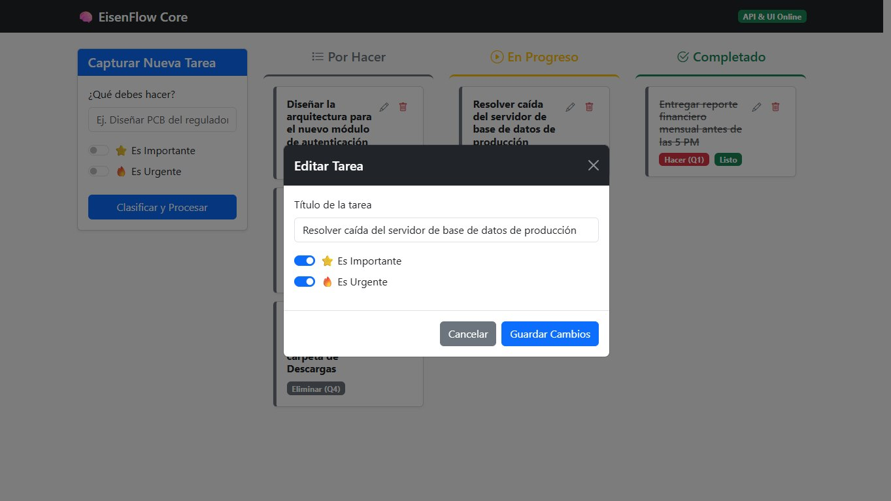
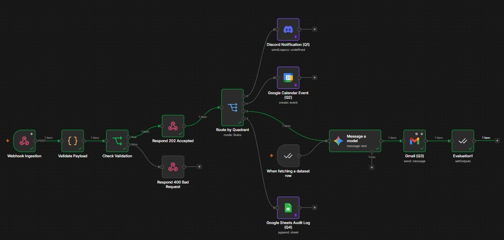

# EisenFlow Core API

**EisenFlow Core** es un microservicio desarrollado en Python con FastAPI que implementa la lógica de gestión de prioridades basada en la Matriz de Eisenhower y un flujo de trabajo tipo Kanban. Este proyecto actúa como el "cerebro" de un sistema de productividad diseñado para reducir la sobrecarga cognitiva en entornos de ingeniería y consultoría.

## 🚀 Arquitectura del Proyecto

El proyecto sigue una estructura modular y profesional de paquetes en Python:

```text
eisenflow-core/
├── app/
│   ├── __init__.py    # Define la carpeta como paquete Python
│   ├── templates/     # Archivos HTML y UI con Jinja2 (index.html)
│   ├── static/        # Directorio de recursos estáticos (CSS, Bootstrap)
│   ├── main.py        # Punto de entrada de FastAPI y rutas de la API (incluye endpoints CRUD)
│   └── models.py      # Lógica POO (Matriz de Eisenhower y Tareas)
├── tests/             # Suite de pruebas automatizadas (unitarias, integración y regresión)
├── venv/              # Entorno virtual aislado
└── requirements.txt   # Dependencias del proyecto
```

## 🛠️ Tecnologías Utilizadas

* Python 3.10+: Lenguaje base del proyecto.
* FastAPI: Framework web de alto rendimiento para construir APIs asíncronas.
* Pydantic v2: Validación de datos y esquemas mediante tipos de Python.
* Uvicorn: Servidor ASGI de alto desempeño para la ejecución del servicio.
* Jinja2: Motor de plantillas dinámicas en backend para renderizar la UI.
* Bootstrap 5 + Bootstrap Icons: Framework e íconos de CSS para la UI moderna y responsiva.

## 📋 Funcionalidades Actuales (¡Completadas y Probadas!)

- [x] **Clasificación Automática**: Algoritmo que asigna tareas a los cuadrantes de Eisenhower (Hacer Q1, Programar Q2, Delegar Q3, Eliminar Q4) basado en urgencia e importancia.
- [x] **Tablero Kanban Dinámico**: Visualización interactiva con soporte nativo de **Drag & Drop** en el navegador para mover tareas entre columnas (*To Do*, *In Progress*, *Done*).
- [x] **CRUD Completo vía API**: Endpoints robustos para consultar, crear, modificar y eliminar tareas en tiempo real.
- [x] **Front-end Integrado**: Formulario intuitivo de captura y panel responsivo renderizado desde el servidor usando Jinja2.
- [x] **Orquestación con n8n (Probado en Producción)**: Integración tolerante a fallos mediante webhooks que envía cada tarea clasificada al motor de flujos n8n para automatizar notificaciones (Slack/Telegram), eventos de Google Calendar o emails.
- [x] **Documentación Interactiva**: Generación automática de Swagger UI (`/docs`) y ReDoc (`/redoc`).

---
## 📸 Capturas de Pantalla

A continuación se muestra la interfaz de **EisenFlow Core** en acción, gestionando el flujo de trabajo y la automatización:

### 📋 Vista del Tablero Kanban


### ✏️ Formulario de Edición de Tareas


### ⚙️ Orquestación y Flujo de Trabajo en n8n


---


## 🔌 Integración y Orquestación con n8n

El backend de **EisenFlow Core** se conecta directamente con un flujo de trabajo automatizado en n8n alojado en el repositorio [n8n_eisenflow](https://github.com/ingwplanchez/n8n_eisenflow). Este flujo recibe cada tarea clasificada mediante un webhook y se encarga de ejecutar acciones automatizadas en distintas herramientas de productividad según el cuadrante asignado.

### Características del Flujo en n8n:
* **Ingesta Dinámica (Webhook)**: Recibe el payload de la tarea en tiempo real.
* **Enrutamiento por Cuadrante**:
  * **Q1 (Hacer - Urgente e Importante)**: Envía notificaciones de alerta inmediata a un canal de **Discord**.
  * **Q2 (Programar - No Urgente pero Importante)**: Agenda automáticamente un bloque de 1 hora en **Google Calendar**.
  * **Q3 (Delegar - Urgente pero No Importante)**: Redacta y envía un correo electrónico formal usando **Gmail** apoyado por **Google Gemini (2.5 Flash)**.
  * **Q4 (Eliminar - No Urgente y No Importante)**: Registra los descartados en una hoja de **Google Sheets** de auditoría.
* **Tolerancia a Fallos**: Configuración de reintentos con backoff exponencial.
* **Manejador Global de Errores**: Captura de excepciones redirigida a Discord.

### Pasos para el Uso y Configuración:
1. **Clonar e Importar Flujos**:
   * Descarga los flujos en formato JSON desde el repositorio [n8n_eisenflow](https://github.com/ingwplanchez/n8n_eisenflow/tree/main/workflows).
   * Importa `eisenhower_matrix_task_orchestrator_v2.json` (flujo principal) y `eisenflow_error_handler.json` (manejador de errores) en tu instancia de n8n.
2. **Configurar el Entorno del Microservicio**:
   * Por defecto, la API de FastAPI se comunica con n8n usando `http://localhost:5678`.
   * Define la variable de entorno `N8N_ENV` para alternar la URL del webhook:
     * Si `N8N_ENV=test` (o no está definida): Envía peticiones al webhook de pruebas (`/webhook-test/eisenhower/tasks`).
     * Si `N8N_ENV=production`: Envía peticiones al webhook de producción (`/webhook/eisenhower/tasks`).
3. **Configurar Credenciales en n8n**:
   * Sigue las instrucciones descritas en [n8n_eisenflow/README.md](https://github.com/ingwplanchez/n8n_eisenflow#readme) para configurar tus credenciales de Google Calendar, Gmail, Gemini API y Discord.

---

## 🔮 Roadmap (Próximos Pasos y Mejoras)

1. **Persistencia en Base de Datos (SQLite/PostgreSQL)**
   - Reemplazar el backend en memoria de `MatrizEisenhower` con base de datos real usando SQLAlchemy y migraciones con Alembic.

2. **Manejo de Errores y Seguridad (CORS)**
   - Configuración de CORS y middleware de excepciones global para mejorar la robustez de las respuestas.

3. **Inteligencia Artificial (IA)**
   - **Clasificador NLP**: Integrar un modelo de lenguaje que determine automáticamente la urgencia e importancia analizando la semántica del texto de la tarea.

4. **Automatizaciones y Reportes**
   - **Limpieza Automática**: Proceso que elimina tareas del cuadrante Q4 a medianoche de forma autónoma.
   - **Reportes Semanales**: Estadísticas sobre productividad y tasas de completado de tareas preventivas (Q2).

---

## 🔧 Ejecución Local

1. Activar el entorno virtual:

```bash
source venv/bin/activate  # Linux/macOS
.\venv\Scripts\activate   # Windows
```

2. Instalar dependencias:

```bash
pip install -r requirements.txt
```

3. Iniciar el servidor de desarrollo:

```bash
uvicorn app.main:app --reload
```

* **Dashboard**: `http://localhost:8000/`
* **Swagger API Docs**: `http://localhost:8000/docs`

---

## Variable de Entorno N8N_ENV

**N8N_ENV** no está definida de forma estática en ningún archivo de configuración (como un archivo .env).

En el código se lee directamente del sistema operativo mediante:

```python
env = os.getenv("N8N_ENV", "test").lower()
```

### ¿Cómo puedes cambiarla tú?

Si deseas forzar el modo de producción o de test al ejecutar el servidor, puedes definirla en la consola antes de iniciar uvicorn:

### En Windows (PowerShell):

```powershell
$env:N8N_ENV="production"
uvicorn app.main:app --reload
```

### En Windows (CMD / Símbolo del Sistema):

```cmd
set N8N_ENV=production
uvicorn app.main:app --reload
```

---

## 🧪 Pruebas Automatizadas (Testing)

El proyecto cuenta con una suite de pruebas automatizadas utilizando `pytest`. Las pruebas se dividen en tres áreas clave dentro del directorio [tests](file:///c:/Users/USER/Documents/wplanchez/Portafolio/Repositorios/FastAPI/eisenflow-core/tests):

*   **Unitarias (`test_models.py`)**: Validan la lógica del modelo de negocio en `models.py` de forma aislada.
*   **Integración (`test_api.py`)**: Validan los endpoints HTTP de FastAPI y las respuestas de la API utilizando `TestClient`.
*   **Regresión (`test_regresion.py`)**: Protegen el funcionamiento core existente (estructura Kanban, consistencia de cuadrantes, accesibilidad a docs, etc.).

### Ejecución de Pruebas

Para ejecutar las pruebas locales, asegúrate de activar el entorno virtual y luego ejecuta:

```bash
# Ejecutar todas las pruebas en modo detallado
pytest tests/ -v

# Ejecutar con reporte de cobertura de código
pytest tests/ --cov=app --cov-report=term-missing
```

-----

## 📄 Licencia

Este proyecto está bajo la licencia [MIT](./LICENSE) (ver archivo [LICENSE](./LICENSE) para más detalles).

-----

Desarrollado por Wilmer Planchez — Ingeniero de Soluciones AI-Native