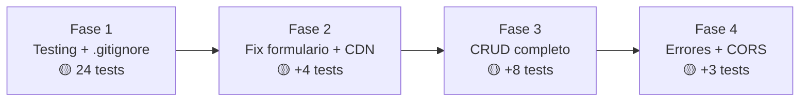

# Plan de Acción — EisenFlow Core

Plan de implementación por fases para estabilizar, completar y fortalecer el proyecto EisenFlow Core.

---

## Estado Actual del Proyecto

El proyecto tiene una base funcional sólida con 3 endpoints operativos, pero presenta **10 problemas documentados** en [AGENTS.md](file:///c:/Users/USER/Documents/wplanchez/Portafolio/Repositorios/FastAPI/eisenflow-core/AGENTS.md) que bloquean su uso real. Los más críticos son:

- ❌ No existen tests automatizados
- ❌ El formulario HTML apunta a `/crear-tarea` que no existe en el backend
- ❌ No se pueden mover ni eliminar tareas
- ❌ No hay manejo centralizado de errores
- ❌ No hay `.gitignore`

---

## Fases de Implementación

### Fase 1 — Infraestructura Base y Testing ⚙️

> **Objetivo**: Establecer la infraestructura de testing y crear la red de seguridad antes de tocar código funcional.

#### [NEW] `.gitignore`

Crear archivo `.gitignore` para excluir archivos generados y el entorno virtual.

```text
.venv/
__pycache__/
*.pyc
*.pyo
.pytest_cache/
htmlcov/
.coverage
*.egg-info/
dist/
build/
```

---

#### [NEW] `tests/__init__.py`

Archivo vacío para definir `tests/` como paquete Python.

---

#### [NEW] `tests/conftest.py`

Fixtures compartidas:
- `client` → `TestClient(app)` con instancia limpia por test
- `tarea_q1`, `tarea_q2`, `tarea_q3`, `tarea_q4` → datos de prueba por cuadrante
- `matriz` → instancia fresca de `MatrizEisenhower` por test

> [!IMPORTANT]
> **Aislamiento crítico**: Dado que el estado de la aplicación vive en memoria (la instancia global `matriz` en `main.py`), cada test de integración debe obtener una instancia limpia. Se usará un fixture que reinicie `app.state` o se recreará la instancia de `MatrizEisenhower` para evitar contaminación entre tests.

---

#### [NEW] `tests/test_models.py` — Tests Unitarios (10 tests)

Prueban la lógica de negocio **aislada** del framework HTTP.

| ID | Test | Qué verifica |
|----|------|-------------|
| UM-01 | `test_tarea_creacion_defaults` | `estado="To Do"` y `cuadrante=""` por defecto |
| UM-02 | `test_tarea_campos_requeridos` | `id`, `titulo`, `urgente`, `importante` son obligatorios |
| UM-03 | `test_tarea_validacion_tipos` | Tipos incorrectos lanzan `ValidationError` |
| UM-04 | `test_matriz_inicializa_tablero_vacio` | `MatrizEisenhower()` crea tablero con 3 columnas vacías |
| UM-05 | `test_clasificar_q1_urgente_importante` | `urgente=True, importante=True` → `"Hacer (Q1)"` |
| UM-06 | `test_clasificar_q2_no_urgente_importante` | `urgente=False, importante=True` → `"Programar (Q2)"` |
| UM-07 | `test_clasificar_q3_urgente_no_importante` | `urgente=True, importante=False` → `"Delegar (Q3)"` |
| UM-08 | `test_clasificar_q4_no_urgente_no_importante` | `urgente=False, importante=False` → `"Eliminar (Q4)"` |
| UM-09 | `test_clasificar_agrega_a_todo` | Tarea clasificada aparece en `tablero_kanban["To Do"]` |
| UM-10 | `test_clasificar_multiples_tareas` | Clasificar N tareas → todas en el tablero |

---

#### [NEW] `tests/test_api.py` — Tests de Integración (8 tests)

Prueban los endpoints HTTP con `TestClient`.

| ID | Test | Qué verifica |
|----|------|-------------|
| IA-01 | `test_root_endpoint` | `GET /` → 200 + mensaje de bienvenida |
| IA-02 | `test_clasificar_tarea_valida` | `POST /tarea/clasificar` con JSON válido → 200 + cuadrante |
| IA-03 | `test_clasificar_tarea_body_invalido` | JSON incompleto → 422 |
| IA-04 | `test_clasificar_tarea_tipos_incorrectos` | Tipos erróneos → 422 |
| IA-05 | `test_tablero_vacio_inicial` | `GET /tablero` → 3 columnas vacías |
| IA-06 | `test_tablero_despues_de_clasificar` | Crear tarea → tarea aparece en "To Do" |
| IA-07 | `test_flujo_completo_multiples_tareas` | Crear varias → todas en tablero con cuadrantes correctos |
| IA-08 | `test_response_model_tarea` | Respuesta contiene todos los campos del modelo |

---

#### [NEW] `tests/test_regresion.py` — Tests de Regresión (6 tests)

Red de seguridad para las fases siguientes.

| ID | Test | Qué protege |
|----|------|-------------|
| RG-01 | `test_clasificacion_determinista` | Misma combinación → mismo cuadrante siempre |
| RG-02 | `test_estado_default_to_do` | Nuevas tareas inician en "To Do" |
| RG-03 | `test_cuadrante_default_vacio` | Cuadrante vacío antes de clasificar |
| RG-04 | `test_tablero_estructura_kanban` | Tablero con exactamente 3 columnas |
| RG-05 | `test_api_docs_accesible` | `GET /docs` → 200 |
| RG-06 | `test_api_openapi_schema` | `GET /openapi.json` → esquema válido |

---

#### Verificación Fase 1

```bash
# Instalar dependencias de testing
pip install pytest pytest-asyncio httpx pytest-cov

# Ejecutar toda la suite
pytest tests/ -v --cov=app --cov-report=term-missing

# Criterio de éxito: 24 tests pasando, cobertura ≥ 85% en models.py
```

---

### Fase 2 — Corregir Funcionalidad Rota 🔧

> **Objetivo**: Hacer que el dashboard HTML funcione de verdad conectando el formulario al backend.

#### [MODIFY] [main.py](file:///c:/Users/USER/Documents/wplanchez/Portafolio/Repositorios/FastAPI/eisenflow-core/app/main.py)

Cambios requeridos:

1. **Agregar imports** para Jinja2 y archivos estáticos:
   ```python
   from fastapi import FastAPI, Request, Form
   from fastapi.templating import Jinja2Templates
   from fastapi.staticfiles import StaticFiles
   from fastapi.responses import RedirectResponse
   ```

2. **Montar archivos estáticos y templates**:
   ```python
   app.mount("/static", StaticFiles(directory="app/static"), name="static")
   templates = Jinja2Templates(directory="app/templates")
   ```

3. **Modificar `GET /`** para renderizar el dashboard con Jinja2:
   ```python
   @app.get("/")
   async def root(request: Request):
       return templates.TemplateResponse("index.html", {
           "request": request,
           "tablero": matriz.tablero_kanban
       })
   ```

4. **Crear endpoint `POST /crear-tarea`** que reciba datos del formulario HTML:
   ```python
   @app.post("/crear-tarea")
   async def crear_tarea_formulario(
       titulo: str = Form(...),
       urgente: bool = Form(False),
       importante: bool = Form(False)
   ):
       # Generar ID incremental
       nuevo_id = generar_siguiente_id()
       tarea = Tarea(id=nuevo_id, titulo=titulo, urgente=urgente, importante=importante)
       matriz.clasificar_tarea(tarea)
       return RedirectResponse(url="/", status_code=303)
   ```

5. **Agregar endpoint API `GET /api/health`** separado del dashboard para health checks programáticos:
   ```python
   @app.get("/api/health")
   async def health_check():
       return {"message": "EisenFlow API is running.", "status": "ok"}
   ```

> [!WARNING]
> Esto cambia el comportamiento de `GET /`: pasa de retornar JSON a renderizar HTML. Cualquier cliente que consuma `GET /` como JSON debe migrar a `GET /api/health`.

---

#### [MODIFY] [index.html](file:///c:/Users/USER/Documents/wplanchez/Portafolio/Repositorios/FastAPI/eisenflow-core/app/templates/index.html)

1. **Corregir URL del CDN de Bootstrap** (línea 7):
   ```diff
   -<link href="https://cdn.jsdelivr.net/npm/bootstrap@5.3.0/dist/modern/bootstrap.min.css" rel="stylesheet">
   +<link href="https://cdn.jsdelivr.net/npm/bootstrap@5.3.0/dist/css/bootstrap.min.css" rel="stylesheet">
   ```

2. **Corregir `class` en las label del formulario** (líneas 58, 63):
   ```diff
   -<label class="form-check-input-label" for="importante">
   +<label class="form-check-label" for="importante">
   ```

3. **Corregir `class` en las task-card** (líneas 79, 97, 111):
   ```diff
   -<div class="card task-card body">
   +<div class="card task-card">
   ```

---

#### Tests Nuevos para Fase 2

| ID | Test | Descripción |
|----|------|-------------|
| F2-01 | `test_root_renderiza_html` | `GET /` retorna HTML con status 200 |
| F2-02 | `test_crear_tarea_formulario` | `POST /crear-tarea` con form data redirige a `/` |
| F2-03 | `test_crear_tarea_aparece_en_tablero` | Crear tarea via form → visible en dashboard |
| F2-04 | `test_api_health_endpoint` | `GET /api/health` retorna JSON con status "ok" |

---

#### Verificación Fase 2

```bash
# Ejecutar tests de regresión + nuevos
pytest tests/ -v

# Verificación manual: abrir http://127.0.0.1:8000/ y crear una tarea desde el formulario
# Criterio de éxito: formulario envía datos → tarea aparece en columna "Por Hacer"
```

---

### Fase 3 — CRUD Completo de Tareas 📝

> **Objetivo**: Implementar las operaciones que faltan — mover tareas entre columnas y eliminar tareas.

#### [MODIFY] [models.py](file:///c:/Users/USER/Documents/wplanchez/Portafolio/Repositorios/FastAPI/eisenflow-core/app/models.py)

Agregar métodos a `MatrizEisenhower`:

```python
def mover_tarea(self, tarea_id: int, nuevo_estado: str) -> Tarea:
    """Mueve una tarea a una nueva columna del Kanban."""
    # Buscar la tarea en todas las columnas
    # Validar que nuevo_estado sea válido ("To Do", "In Progress", "Done")
    # Remover de columna actual, agregar a nueva columna
    # Retornar la tarea actualizada

def eliminar_tarea(self, tarea_id: int) -> Tarea:
    """Elimina una tarea del tablero Kanban."""
    # Buscar la tarea en todas las columnas
    # Removerla y retornarla

def buscar_tarea(self, tarea_id: int) -> tuple[str, Tarea] | None:
    """Busca una tarea por ID y retorna (columna, tarea) o None."""
```

---

#### [MODIFY] [main.py](file:///c:/Users/USER/Documents/wplanchez/Portafolio/Repositorios/FastAPI/eisenflow-core/app/main.py)

Agregar nuevos endpoints:

| Método | Ruta | Descripción |
|--------|------|-------------|
| `PUT` | `/tarea/{tarea_id}/mover` | Mover tarea a nueva columna Kanban |
| `DELETE` | `/tarea/{tarea_id}` | Eliminar tarea del tablero |
| `GET` | `/tarea/{tarea_id}` | Obtener tarea por ID |

```python
from fastapi import HTTPException

class MoverTareaRequest(BaseModel):
    nuevo_estado: str  # "To Do" | "In Progress" | "Done"

@app.put("/tarea/{tarea_id}/mover")
async def mover_tarea(tarea_id: int, request: MoverTareaRequest):
    # Validar estados permitidos
    # Llamar a matriz.mover_tarea()
    # Manejar 404 si no existe

@app.delete("/tarea/{tarea_id}")
async def eliminar_tarea(tarea_id: int):
    # Llamar a matriz.eliminar_tarea()
    # Manejar 404 si no existe

@app.get("/tarea/{tarea_id}", response_model=Tarea)
async def obtener_tarea(tarea_id: int):
    # Llamar a matriz.buscar_tarea()
    # Manejar 404 si no existe
```

---

#### Tests Nuevos para Fase 3

| ID | Test | Descripción |
|----|------|-------------|
| KN-01 | `test_mover_tarea_todo_a_in_progress` | Mover de "To Do" a "In Progress" |
| KN-02 | `test_mover_tarea_in_progress_a_done` | Mover de "In Progress" a "Done" |
| KN-03 | `test_mover_tarea_invalida_404` | ID inexistente → 404 |
| KN-04 | `test_mover_tarea_estado_invalido` | Estado inválido → 422 |
| DEL-01 | `test_eliminar_tarea_existente` | Eliminar tarea → 200 + ya no está en tablero |
| DEL-02 | `test_eliminar_tarea_inexistente` | ID inexistente → 404 |
| GET-01 | `test_obtener_tarea_existente` | Obtener por ID → 200 + datos correctos |
| GET-02 | `test_obtener_tarea_inexistente` | ID inexistente → 404 |

---

#### Verificación Fase 3

```bash
pytest tests/ -v --cov=app --cov-report=term-missing
# Criterio de éxito: todos los tests pasan, cobertura ≥ 90%
```

---

### Fase 4 — Manejo de Errores y CORS 🛡️

> **Objetivo**: Agregar middleware de errores y configuración CORS para robustez en producción.

#### [MODIFY] [main.py](file:///c:/Users/USER/Documents/wplanchez/Portafolio/Repositorios/FastAPI/eisenflow-core/app/main.py)

1. **Configurar CORS**:
   ```python
   from fastapi.middleware.cors import CORSMiddleware

   app.add_middleware(
       CORSMiddleware,
       allow_origins=["*"],  # En producción, especificar dominios
       allow_credentials=True,
       allow_methods=["*"],
       allow_headers=["*"],
   )
   ```

2. **Agregar exception handlers centralizados**:
   ```python
   from fastapi.exceptions import RequestValidationError
   from starlette.exceptions import HTTPException as StarletteHTTPException

   @app.exception_handler(RequestValidationError)
   async def validacion_exception_handler(request, exc):
       return JSONResponse(
           status_code=422,
           content={"error": "Error de validación", "detalle": exc.errors()}
       )

   @app.exception_handler(Exception)
   async def error_general_handler(request, exc):
       return JSONResponse(
           status_code=500,
           content={"error": "Error interno del servidor"}
       )
   ```

---

#### Tests Nuevos para Fase 4

| ID | Test | Descripción |
|----|------|-------------|
| ER-01 | `test_error_handler_validation_error` | Errores de validación retornan JSON estructurado |
| ER-02 | `test_error_handler_500` | Errores internos retornan JSON genérico |
| ER-03 | `test_cors_headers` | Respuestas incluyen headers CORS correctos |

---

#### Verificación Fase 4

```bash
pytest tests/ -v --cov=app --cov-report=term-missing
# Criterio de éxito: cobertura total ≥ 90%, todos los tests pasan
```

---

## Resumen de Entregables por Fase

| Fase | Archivos Nuevos | Archivos Modificados | Tests Nuevos |
|------|----------------|---------------------|-------------|
| **1** | `.gitignore`, `tests/__init__.py`, `tests/conftest.py`, `tests/test_models.py`, `tests/test_api.py`, `tests/test_regresion.py` | — | 24 |
| **2** | — | `main.py`, `index.html` | 4 |
| **3** | — | `models.py`, `main.py` | 8 |
| **4** | — | `main.py` | 3 |
| **Total** | **6 archivos** | **3 archivos** | **39 tests** |

---

## Orden de Ejecución



Cada fase se ejecuta solo después de que **todos los tests de la fase anterior pasen al 100%**.

---

## Open Questions

> [!IMPORTANT]
> **Cambio en `GET /`**: La Fase 2 propone que `GET /` pase de retornar JSON a renderizar el dashboard HTML. ¿Estás de acuerdo con crear `GET /api/health` como reemplazo para health checks programáticos?

> [!IMPORTANT]
> **CORS abierto vs restringido**: La Fase 4 propone `allow_origins=["*"]` (abierto a todo). ¿Tienes dominios específicos que quieras restringir, o prefieres dejarlo abierto para desarrollo?

> [!IMPORTANT]
> **Generación de IDs**: Actualmente el `id` se envía desde el cliente. La Fase 2 propone generar IDs automáticamente en el servidor para evitar duplicados. ¿Estás de acuerdo con este cambio?
